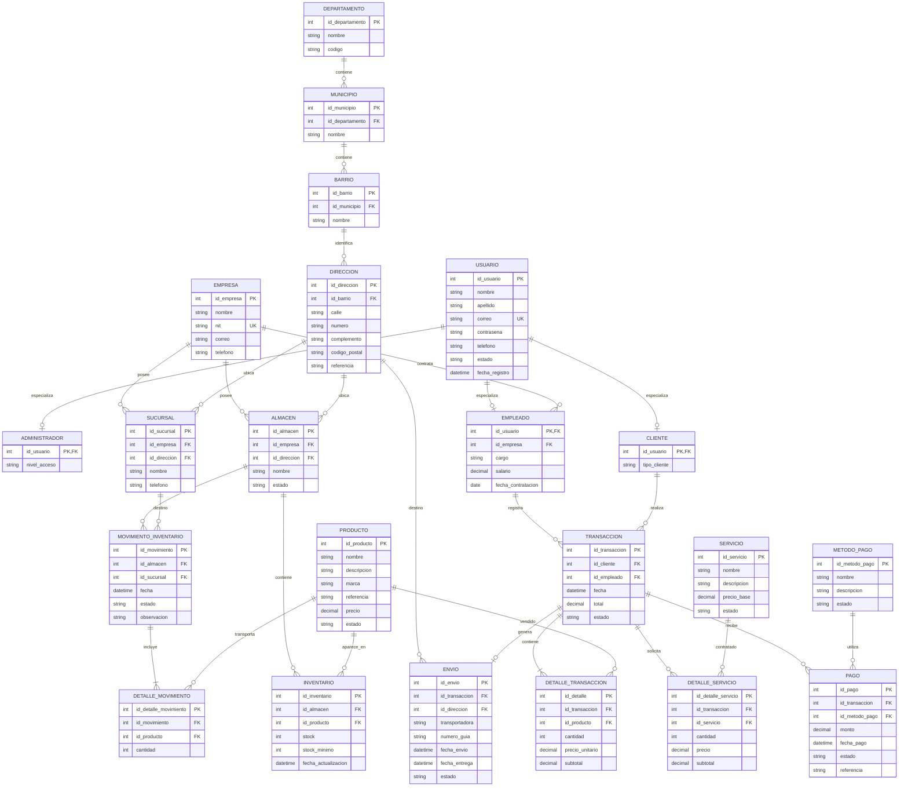

```mermaid
erDiagram
    USUARIO {
        int id_usuario PK
        string nombre
        string apellido
        string correo UK
        string contrasena
        string telefono
        string estado
        datetime fecha_registro
    }

    ADMINISTRADOR {
        int id_usuario PK, FK
        string nivel_acceso
    }

    CLIENTE {
        int id_usuario PK, FK
        string tipo_cliente
    }

    EMPLEADO {
        int id_usuario PK, FK
        int id_empresa FK
        string cargo
        decimal salario
        date fecha_contratacion
    }

    EMPRESA {
        int id_empresa PK
        string nombre
        string nit UK
        string correo
        string telefono
    }

    SUCURSAL {
        int id_sucursal PK
        int id_empresa FK
        int id_direccion FK
        string nombre
        string telefono
    }

    ALMACEN {
        int id_almacen PK
        int id_empresa FK
        int id_direccion FK
        string nombre
        string estado
    }

    DIRECCION {
        int id_direccion PK
        int id_barrio FK
        string calle
        string numero
        string complemento
        string codigo_postal
        string referencia
    }

    BARRIO {
        int id_barrio PK
        int id_municipio FK
        string nombre
    }

    MUNICIPIO {
        int id_municipio PK
        int id_departamento FK
        string nombre
    }

    DEPARTAMENTO {
        int id_departamento PK
        string nombre
        string codigo
    }

    PRODUCTO {
        int id_producto PK
        string nombre
        string descripcion
        string marca
        string referencia
        decimal precio
        string estado
    }

    INVENTARIO {
        int id_inventario PK
        int id_almacen FK
        int id_producto FK
        int stock
        int stock_minimo
        datetime fecha_actualizacion
    }

    MOVIMIENTO_INVENTARIO {
        int id_movimiento PK
        int id_almacen FK
        int id_sucursal FK
        datetime fecha
        string estado
        string observacion
    }

    DETALLE_MOVIMIENTO {
        int id_detalle_movimiento PK
        int id_movimiento FK
        int id_producto FK
        int cantidad
    }

    TRANSACCION {
        int id_transaccion PK
        int id_cliente FK
        int id_empleado FK
        datetime fecha
        decimal total
        string estado
    }

    DETALLE_TRANSACCION {
        int id_detalle PK
        int id_transaccion FK
        int id_producto FK
        int cantidad
        decimal precio_unitario
        decimal subtotal
    }

    SERVICIO {
        int id_servicio PK
        string nombre
        string descripcion
        decimal precio_base
        string estado
    }

    DETALLE_SERVICIO {
        int id_detalle_servicio PK
        int id_transaccion FK
        int id_servicio FK
        int cantidad
        decimal precio
        decimal subtotal
    }

    METODO_PAGO {
        int id_metodo_pago PK
        string nombre
        string descripcion
        string estado
    }

    PAGO {
        int id_pago PK
        int id_transaccion FK
        int id_metodo_pago FK
        decimal monto
        datetime fecha_pago
        string estado
        string referencia
    }

    ENVIO {
        int id_envio PK
        int id_transaccion FK
        int id_direccion FK
        string transportadora
        string numero_guia
        datetime fecha_envio
        datetime fecha_entrega
        string estado
    }

    USUARIO ||--o| ADMINISTRADOR : especializa
    USUARIO ||--o| CLIENTE : especializa
    USUARIO ||--o| EMPLEADO : especializa

    EMPRESA ||--o{ EMPLEADO : contrata
    EMPRESA ||--o{ SUCURSAL : posee
    EMPRESA ||--o{ ALMACEN : posee

    DIRECCION ||--o{ SUCURSAL : ubica
    DIRECCION ||--o{ ALMACEN : ubica
    DIRECCION ||--o{ ENVIO : destino

    DEPARTAMENTO ||--o{ MUNICIPIO : contiene
    MUNICIPIO ||--o{ BARRIO : contiene
    BARRIO ||--o{ DIRECCION : identifica

    EMPLEADO ||--o{ TRANSACCION : registra
    CLIENTE ||--o{ TRANSACCION : realiza

    ALMACEN ||--o{ INVENTARIO : contiene
    PRODUCTO ||--o{ INVENTARIO : aparece_en

    ALMACEN ||--o{ MOVIMIENTO_INVENTARIO : origen
    SUCURSAL ||--o{ MOVIMIENTO_INVENTARIO : destino
    MOVIMIENTO_INVENTARIO ||--|{ DETALLE_MOVIMIENTO : incluye
    PRODUCTO ||--o{ DETALLE_MOVIMIENTO : transporta

    TRANSACCION ||--|{ DETALLE_TRANSACCION : contiene
    PRODUCTO ||--o{ DETALLE_TRANSACCION : vendido

    TRANSACCION ||--o{ DETALLE_SERVICIO : solicita
    SERVICIO ||--o{ DETALLE_SERVICIO : contratado

    TRANSACCION ||--o{ PAGO : recibe
    METODO_PAGO ||--o{ PAGO : utiliza


    TRANSACCION ||--o| ENVIO : genera
```
