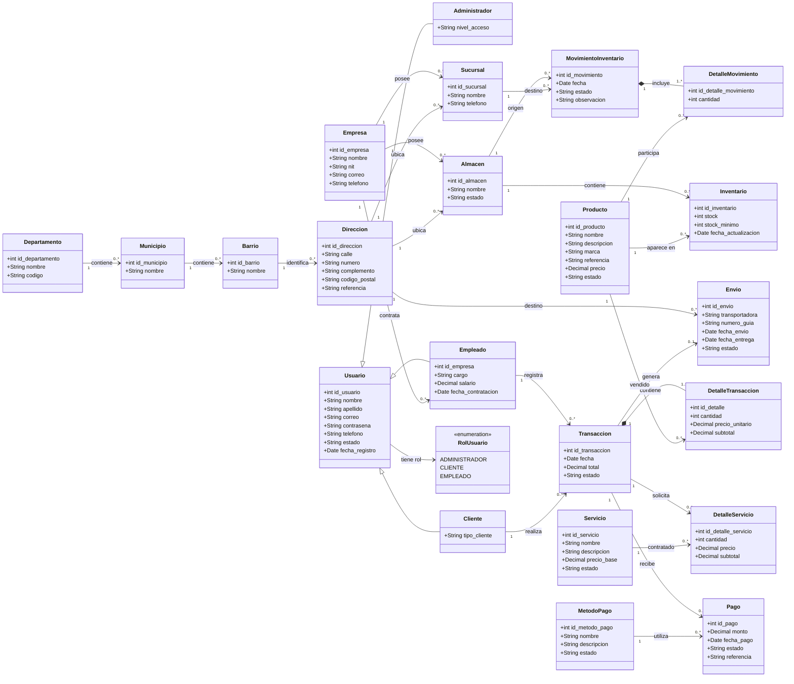

```mermaid

classDiagram
    direction LR

    class Usuario {
        +int id_usuario
        +String nombre
        +String apellido
        +String correo
        +String contrasena
        +String telefono
        +String estado
        +Date fecha_registro
    }

    class Administrador {
        +String nivel_acceso
    }

    class Cliente {
        +String tipo_cliente
    }

    class Empleado {
        +int id_empresa
        +String cargo
        +Decimal salario
        +Date fecha_contratacion
    }

    class Empresa {
        +int id_empresa
        +String nombre
        +String nit
        +String correo
        +String telefono
    }

    class Sucursal {
        +int id_sucursal
        +String nombre
        +String telefono
    }

    class Almacen {
        +int id_almacen
        +String nombre
        +String estado
    }

    class Direccion {
        +int id_direccion
        +String calle
        +String numero
        +String complemento
        +String codigo_postal
        +String referencia
    }

    class Barrio {
        +int id_barrio
        +String nombre
    }

    class Municipio {
        +int id_municipio
        +String nombre
    }

    class Departamento {
        +int id_departamento
        +String nombre
        +String codigo
    }

    class Producto {
        +int id_producto
        +String nombre
        +String descripcion
        +String marca
        +String referencia
        +Decimal precio
        +String estado
    }

    class Inventario {
        +int id_inventario
        +int stock
        +int stock_minimo
        +Date fecha_actualizacion
    }

    class MovimientoInventario {
        +int id_movimiento
        +Date fecha
        +String estado
        +String observacion
    }

    class DetalleMovimiento {
        +int id_detalle_movimiento
        +int cantidad
    }

    class Transaccion {
        +int id_transaccion
        +Date fecha
        +Decimal total
        +String estado
    }

    class DetalleTransaccion {
        +int id_detalle
        +int cantidad
        +Decimal precio_unitario
        +Decimal subtotal
    }

    class Servicio {
        +int id_servicio
        +String nombre
        +String descripcion
        +Decimal precio_base
        +String estado
    }

    class DetalleServicio {
        +int id_detalle_servicio
        +int cantidad
        +Decimal precio
        +Decimal subtotal
    }

    class MetodoPago {
        +int id_metodo_pago
        +String nombre
        +String descripcion
        +String estado
    }

    class Pago {
        +int id_pago
        +Decimal monto
        +Date fecha_pago
        +String estado
        +String referencia
    }

    class Envio {
        +int id_envio
        +String transportadora
        +String numero_guia
        +Date fecha_envio
        +Date fecha_entrega
        +String estado
    }

    class RolUsuario {
        <<enumeration>>
        ADMINISTRADOR
        CLIENTE
        EMPLEADO
    }

    Usuario --> RolUsuario : tiene rol
    Usuario <|-- Administrador
    Usuario <|-- Cliente
    Usuario <|-- Empleado

    Empresa "1" --> "0..*" Empleado : contrata
    Empresa "1" --> "0..*" Sucursal : posee
    Empresa "1" --> "0..*" Almacen : posee

    Direccion "1" --> "0..*" Sucursal : ubica
    Direccion "1" --> "0..*" Almacen : ubica
    Direccion "1" --> "0..*" Envio : destino

    Departamento "1" --> "0..*" Municipio : contiene
    Municipio "1" --> "0..*" Barrio : contiene
    Barrio "1" --> "0..*" Direccion : identifica

    Empleado "1" --> "0..*" Transaccion : registra
    Cliente "1" --> "0..*" Transaccion : realiza

    Almacen "1" --> "0..*" Inventario : contiene
    Producto "1" --> "0..*" Inventario : aparece en

    Almacen "1" --> "0..*" MovimientoInventario : origen
    Sucursal "1" --> "0..*" MovimientoInventario : destino
    MovimientoInventario "1" *-- "1..*" DetalleMovimiento : incluye
    Producto "1" --> "0..*" DetalleMovimiento : participa

    Transaccion "1" *-- "1..*" DetalleTransaccion : contiene
    Producto "1" --> "0..*" DetalleTransaccion : vendido

    Transaccion "1" --> "0..*" DetalleServicio : solicita
    Servicio "1" --> "0..*" DetalleServicio : contratado

    Transaccion "1" --> "0..*" Pago : recibe
    MetodoPago "1" --> "0..*" Pago : utiliza

    Transaccion "1" --> "0..1" Envio : genera

```
