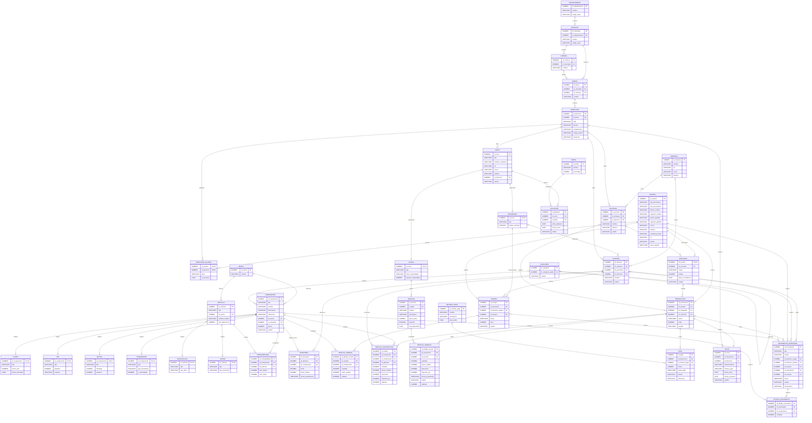

```mermaid

erDiagram
    DEPARTAMENTO {
        NUMBER id_departamento PK
        VARCHAR2 nombre
        VARCHAR2 codigo_dane
    }
    MUNICIPIO {
        NUMBER id_municipio PK
        NUMBER id_departamento FK
        VARCHAR2 nombre
        VARCHAR2 codigo_dane
    }
    COMUNA {
        NUMBER id_comuna PK
        NUMBER id_municipio FK
        VARCHAR2 nombre
    }
    BARRIO {
        NUMBER id_barrio PK
        NUMBER id_municipio FK
        NUMBER id_comuna FK
        VARCHAR2 nombre
    }
    DIRECCION {
        NUMBER id_direccion PK
        NUMBER id_barrio FK
        VARCHAR2 calle
        VARCHAR2 numero
        VARCHAR2 complemento
        VARCHAR2 codigo_postal
        VARCHAR2 referencia
    }
    USUARIO {
        NUMBER id_usuario PK
        VARCHAR2 tipo_documento
        VARCHAR2 num_documento
        VARCHAR2 primer_nombre
        VARCHAR2 segundo_nombre
        VARCHAR2 primer_apellido
        VARCHAR2 segundo_apellido
        VARCHAR2 correo
        VARCHAR2 telefono
        VARCHAR2 contrasena_hash
        VARCHAR2 rol
        VARCHAR2 estado
        TIMESTAMP fecha_registro
    }
    DIRECCION_USUARIO {
        NUMBER id_usuario PK, FK
        NUMBER id_direccion PK, FK
        VARCHAR2 alias
        CHAR es_principal
    }
    EMPRESA {
        NUMBER id_empresa PK
        VARCHAR2 nombre
        VARCHAR2 nit
        VARCHAR2 correo
        VARCHAR2 telefono
    }
    SUCURSAL {
        NUMBER id_sucursal PK
        NUMBER id_empresa FK
        NUMBER id_direccion FK
        VARCHAR2 nombre
        VARCHAR2 telefono
        VARCHAR2 estado
    }
    EMPLEADO {
        NUMBER id_usuario PK, FK
        NUMBER id_sucursal FK
        VARCHAR2 cargo
        NUMBER salario
        DATE fecha_contratacion
        VARCHAR2 estado
    }
    SOCIO {
        NUMBER id_socio PK
        VARCHAR2 tipo
        VARCHAR2 nombre_compania
        VARCHAR2 nit
        VARCHAR2 correo
        VARCHAR2 telefono
        NUMBER id_direccion FK
        VARCHAR2 estado
    }
    PROVEEDOR {
        NUMBER id_socio PK, FK
        VARCHAR2 tipo
        INTERVAL tiempo_entrega
    }
    TALLER {
        NUMBER id_socio PK, FK
        VARCHAR2 tipo
        VARCHAR2 descr_especialidad
        NUMBER espacios_disponibles
    }
    TARIFA {
        NUMBER id_tarifa PK
        VARCHAR2 nombre
        NUMBER porcentaje
    }
    AFILIACION {
        NUMBER id_afiliacion PK
        NUMBER id_socio FK
        NUMBER id_tarifa FK
        DATE fecha_afiliacion
        DATE fecha_vence
        VARCHAR2 estado
    }
    MARCA {
        NUMBER id_marca PK
        VARCHAR2 nombre
    }
    CATEGORIA {
        NUMBER id_categoria PK
        NUMBER id_categoria_padre FK
        VARCHAR2 nombre
    }
    COMPONENTE {
        NUMBER id_componente PK
        VARCHAR2 tipo
        VARCHAR2 nombre
        VARCHAR2 descripcion
        VARCHAR2 referencia
        NUMBER id_marca FK
        NUMBER id_categoria FK
        NUMBER precio
        VARCHAR2 estado
    }
    LLANTA {
        NUMBER id_componente PK, FK
        VARCHAR2 tipo
        NUMBER ancho_mm
        CHAR indice_velocidad
    }
    RIN {
        NUMBER id_componente PK, FK
        VARCHAR2 tipo
        NUMBER diametro
        VARCHAR2 material
    }
    MOTOR {
        NUMBER id_componente PK, FK
        VARCHAR2 tipo
        NUMBER cilindraje
        NUMBER potencia
    }
    TRANSMISION {
        NUMBER id_componente PK, FK
        VARCHAR2 tipo
        VARCHAR2 tipo_transmision
        NUMBER n_velocidades
    }
    VEHICULO {
        NUMBER id_vehiculo PK
        VARCHAR2 tipo
        NUMBER id_marca FK
        VARCHAR2 nombre_modelo
        NUMBER anio_fabricacion
    }
    MOTOCICLETA {
        NUMBER id_vehiculo PK, FK
        VARCHAR2 tipo
        VARCHAR2 tipo_moto
    }
    COCHE {
        NUMBER id_vehiculo PK, FK
        VARCHAR2 tipo
        VARCHAR2 tipo_carroceria
    }
    COMPATIBILIDAD {
        NUMBER id_compatibilidad PK
        NUMBER id_componente FK
        NUMBER id_vehiculo FK
        NUMBER anio_desde
        NUMBER anio_hasta
    }
    ALMACEN {
        NUMBER id_almacen PK
        NUMBER id_empresa FK
        NUMBER id_proveedor FK
        NUMBER id_direccion FK
        VARCHAR2 nombre
        VARCHAR2 estado
    }
    INVENTARIO {
        NUMBER id_inventario PK
        NUMBER id_almacen FK
        NUMBER id_componente FK
        NUMBER stock
        NUMBER stock_minimo
        TIMESTAMP fecha_actualizacion
    }
    COMPRA {
        NUMBER id_compra PK
        NUMBER id_proveedor FK
        NUMBER id_almacen_destino FK
        NUMBER id_usuario FK
        TIMESTAMP fecha
        NUMBER total
        VARCHAR2 estado
    }
    DETALLE_COMPRA {
        NUMBER id_detalle_compra PK
        NUMBER id_compra FK
        NUMBER id_componente FK
        NUMBER cantidad
        NUMBER costo_unitario
        NUMBER subtotal
    }
    SERVICIO {
        NUMBER id_servicio PK
        NUMBER id_taller FK
        VARCHAR2 nombre
        VARCHAR2 descripcion
        NUMBER precio_base
        INTERVAL duracion
        CHAR esta_disponible
    }
    METODO_PAGO {
        NUMBER id_metodo_pago PK
        VARCHAR2 nombre
        VARCHAR2 descripcion
        CHAR esta_activo
    }
    TRANSACCION {
        NUMBER id_transaccion PK
        NUMBER id_usuario FK
        NUMBER id_empleado FK
        NUMBER id_sucursal FK
        TIMESTAMP fecha
        NUMBER total
        VARCHAR2 estado
    }
    DETALLE_TRANSACCION {
        NUMBER id_detalle PK
        NUMBER id_transaccion FK
        NUMBER id_componente FK
        NUMBER id_almacen FK
        NUMBER cantidad
        NUMBER precio_unitario
        NUMBER descuento
        NUMBER impuesto_pct
        NUMBER subtotal
    }
    DETALLE_SERVICIO {
        NUMBER id_detalle_servicio PK
        NUMBER id_transaccion FK
        NUMBER id_servicio FK
        NUMBER cantidad
        NUMBER precio_unitario
        NUMBER descuento
        NUMBER impuesto_pct
        TIMESTAMP fecha_programada
        VARCHAR2 estado
        NUMBER subtotal
    }
    PAGO {
        NUMBER id_pago PK
        NUMBER id_transaccion FK
        NUMBER id_metodo_pago FK
        NUMBER monto
        TIMESTAMP fecha_pago
        VARCHAR2 estado
        VARCHAR2 referencia
    }
    ENVIO {
        NUMBER id_envio PK
        NUMBER id_transaccion FK
        NUMBER id_direccion FK
        VARCHAR2 transportadora
        VARCHAR2 numero_guia
        DATE fecha_envio
        DATE fecha_recepcion
        VARCHAR2 estado
    }
    MOVIMIENTO_INVENTARIO {
        NUMBER id_movimiento PK
        VARCHAR2 tipo
        VARCHAR2 motivo
        NUMBER id_almacen_origen FK
        NUMBER id_almacen_destino FK
        NUMBER id_usuario FK
        NUMBER id_transaccion FK
        NUMBER id_compra FK
        TIMESTAMP fecha
        VARCHAR2 estado
        VARCHAR2 observacion
    }
    DETALLE_MOVIMIENTO {
        NUMBER id_detalle_movimiento PK
        NUMBER id_movimiento FK
        NUMBER id_componente FK
        NUMBER cantidad
    }

    DEPARTAMENTO ||--o{ MUNICIPIO : contiene
    MUNICIPIO ||--o{ COMUNA : contiene
    MUNICIPIO ||--o{ BARRIO : contiene
    COMUNA o|--o{ BARRIO : agrupa
    BARRIO ||--o{ DIRECCION : contiene
    USUARIO ||--o{ DIRECCION_USUARIO : guarda
    DIRECCION ||--o{ DIRECCION_USUARIO : asignada

    EMPRESA ||--o{ SUCURSAL : posee
    DIRECCION ||--o{ SUCURSAL : ubica
    USUARIO ||--o| EMPLEADO : especializa
    SUCURSAL ||--o{ EMPLEADO : asigna
    DIRECCION ||--o{ SOCIO : ubica
    SOCIO ||--o| PROVEEDOR : especializa
    SOCIO ||--o| TALLER : especializa
    SOCIO ||--o{ AFILIACION : registra
    TARIFA ||--o{ AFILIACION : establece

    MARCA ||--o{ COMPONENTE : identifica
    CATEGORIA o|--o{ CATEGORIA : jerarquia
    CATEGORIA o|--o{ COMPONENTE : clasifica
    COMPONENTE ||--o| LLANTA : subtipo
    COMPONENTE ||--o| RIN : subtipo
    COMPONENTE ||--o| MOTOR : subtipo
    COMPONENTE ||--o| TRANSMISION : subtipo
    MARCA ||--o{ VEHICULO : fabrica
    VEHICULO ||--o| MOTOCICLETA : subtipo
    VEHICULO ||--o| COCHE : subtipo
    COMPONENTE ||--o{ COMPATIBILIDAD : compatible
    VEHICULO ||--o{ COMPATIBILIDAD : admite

    EMPRESA o|--o{ ALMACEN : posee
    PROVEEDOR o|--o{ ALMACEN : suministra
    DIRECCION ||--o{ ALMACEN : ubica
    ALMACEN ||--o{ INVENTARIO : almacena
    COMPONENTE ||--o{ INVENTARIO : registra_stock
    PROVEEDOR ||--o{ COMPRA : recibe_pedido
    ALMACEN ||--o{ COMPRA : destino
    USUARIO ||--o{ COMPRA : registra
    COMPRA ||--|{ DETALLE_COMPRA : contiene
    COMPONENTE ||--o{ DETALLE_COMPRA : comprado

    TALLER ||--o{ SERVICIO : ofrece
    USUARIO ||--o{ TRANSACCION : compra
    EMPLEADO o|--o{ TRANSACCION : atiende
    SUCURSAL o|--o{ TRANSACCION : registra
    TRANSACCION ||--o{ DETALLE_TRANSACCION : contiene
    COMPONENTE ||--o{ DETALLE_TRANSACCION : vendido
    ALMACEN ||--o{ DETALLE_TRANSACCION : suministra
    TRANSACCION ||--o{ DETALLE_SERVICIO : solicita
    SERVICIO ||--o{ DETALLE_SERVICIO : contratado
    TRANSACCION ||--o{ PAGO : recibe
    METODO_PAGO ||--o{ PAGO : utiliza
    TRANSACCION ||--o| ENVIO : genera
    DIRECCION ||--o{ ENVIO : destino

    ALMACEN o|--o{ MOVIMIENTO_INVENTARIO : origen
    ALMACEN o|--o{ MOVIMIENTO_INVENTARIO : destino
    USUARIO ||--o{ MOVIMIENTO_INVENTARIO : registra
    TRANSACCION o|--o{ MOVIMIENTO_INVENTARIO : venta
    COMPRA o|--o{ MOVIMIENTO_INVENTARIO : compra
    MOVIMIENTO_INVENTARIO ||--|{ DETALLE_MOVIMIENTO : contiene
    COMPONENTE ||--o{ DETALLE_MOVIMIENTO : moviliza

```
