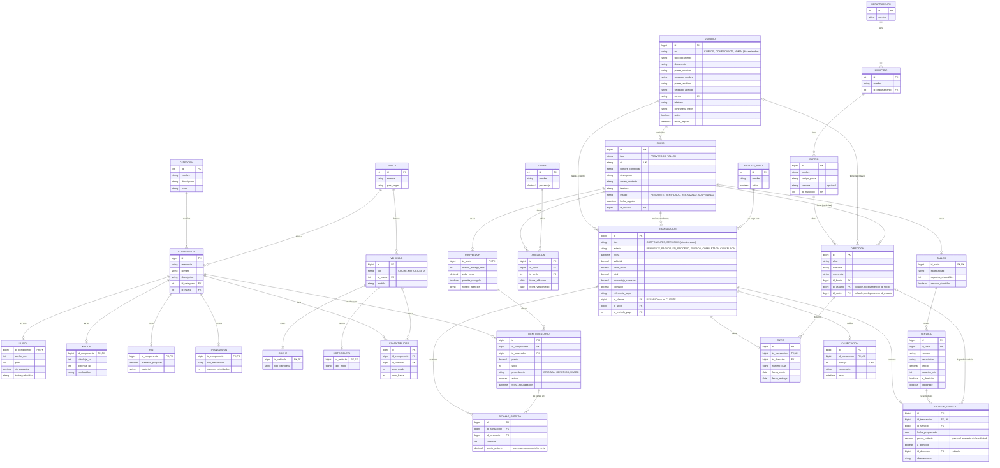

```mermaid
erDiagram
    %% ===== Ubicación =====
    DEPARTAMENTO ||--o{ MUNICIPIO : tiene
    MUNICIPIO ||--o{ BARRIO : tiene
    BARRIO ||--o{ DIRECCION : ubica
    USUARIO |o--o{ DIRECCION : "tiene (exclusiva)"
    SOCIO |o--o{ DIRECCION : "tiene (exclusiva)"

    %% ===== Usuarios y socios =====
    USUARIO ||--o{ SOCIO : administra
    SOCIO ||--o| PROVEEDOR : "es un"
    SOCIO ||--o| TALLER : "es un"
    SOCIO ||--o{ AFILIACION : tiene
    TARIFA ||--o{ AFILIACION : aplica

    %% ===== Catálogo =====
    CATEGORIA ||--o{ COMPONENTE : clasifica
    MARCA ||--o{ COMPONENTE : fabrica
    MARCA ||--o{ VEHICULO : fabrica
    COMPONENTE ||--o| LLANTA : "es una"
    COMPONENTE ||--o| MOTOR : "es un"
    COMPONENTE ||--o| RIN : "es un"
    COMPONENTE ||--o| TRANSMISION : "es una"
    VEHICULO ||--o| COCHE : "es un"
    VEHICULO ||--o| MOTOCICLETA : "es una"
    COMPONENTE ||--o{ COMPATIBILIDAD : tiene
    VEHICULO ||--o{ COMPATIBILIDAD : tiene

    %% ===== Oferta =====
    COMPONENTE ||--o{ ITEM_INVENTARIO : "se ofrece en"
    PROVEEDOR ||--o{ ITEM_INVENTARIO : ofrece
    TALLER ||--o{ SERVICIO : ofrece

    %% ===== Transacciones =====
    USUARIO ||--o{ TRANSACCION : "realiza (cliente)"
    SOCIO ||--o{ TRANSACCION : "recibe (vendedor)"
    METODO_PAGO ||--o{ TRANSACCION : "se paga con"
    TRANSACCION ||--o{ DETALLE_COMPRA : contiene
    ITEM_INVENTARIO ||--o{ DETALLE_COMPRA : "se vende en"
    TRANSACCION ||--o| DETALLE_SERVICIO : contiene
    SERVICIO ||--o{ DETALLE_SERVICIO : "se solicita en"
    DIRECCION |o--o{ DETALLE_SERVICIO : "lugar del servicio"
    TRANSACCION ||--o| ENVIO : tiene
    DIRECCION ||--o{ ENVIO : "destino"
    TRANSACCION ||--o| CALIFICACION : recibe

    DEPARTAMENTO {
        int id PK
        string nombre
    }

    MUNICIPIO {
        int id PK
        string nombre
        int id_departamento FK
    }

    BARRIO {
        bigint id PK
        string nombre
        string codigo_postal
        string comuna "opcional"
        int id_municipio FK
    }

    DIRECCION {
        bigint id PK
        string alias
        string direccion
        string referencia
        bigint id_barrio FK
        bigint id_usuario FK "nullable, excluyente con id_socio"
        bigint id_socio FK "nullable, excluyente con id_usuario"
    }

    USUARIO {
        bigint id PK
        string rol "CLIENTE, COMERCIANTE, ADMIN (discriminador)"
        string tipo_documento
        string documento
        string primer_nombre
        string segundo_nombre
        string primer_apellido
        string segundo_apellido
        string correo UK
        string telefono
        string contrasena_hash
        boolean activo
        datetime fecha_registro
    }

    TARIFA {
        int id PK
        string nombre
        decimal porcentaje
    }

    SOCIO {
        bigint id PK
        string tipo "PROVEEDOR, TALLER"
        string nit UK
        string nombre_comercial
        string descripcion
        string correo_contacto
        string telefono
        string estado "PENDIENTE, VERIFICADO, RECHAZADO, SUSPENDIDO"
        datetime fecha_registro
        bigint id_usuario FK
    }

    PROVEEDOR {
        bigint id_socio PK, FK
        int tiempo_entrega_dias
        decimal valor_envio
        boolean permite_recogida
        string horario_atencion
    }

    TALLER {
        bigint id_socio PK, FK
        string especialidad
        int espacios_disponibles
        boolean servicio_domicilio
    }

    AFILIACION {
        bigint id PK
        bigint id_socio FK
        int id_tarifa FK
        date fecha_afiliacion
        date fecha_vencimiento
    }

    CATEGORIA {
        int id PK
        string nombre
        string descripcion
        string icono
    }

    MARCA {
        int id PK
        string nombre
        string pais_origen
    }

    COMPONENTE {
        bigint id PK
        string referencia
        string nombre
        string descripcion
        int id_categoria FK
        int id_marca FK
    }

    LLANTA {
        bigint id_componente PK, FK
        int ancho_mm
        int perfil
        decimal rin_pulgadas
        string indice_velocidad
    }

    MOTOR {
        bigint id_componente PK, FK
        int cilindraje_cc
        int potencia_hp
        string combustible
    }

    RIN {
        bigint id_componente PK, FK
        decimal diametro_pulgadas
        string material
    }

    TRANSMISION {
        bigint id_componente PK, FK
        string tipo_transmision
        int numero_velocidades
    }

    VEHICULO {
        bigint id PK
        string tipo "COCHE, MOTOCICLETA"
        int id_marca FK
        string modelo
    }

    COCHE {
        bigint id_vehiculo PK, FK
        string tipo_carroceria
    }

    MOTOCICLETA {
        bigint id_vehiculo PK, FK
        string tipo_moto
    }

    COMPATIBILIDAD {
        bigint id PK
        bigint id_componente FK
        bigint id_vehiculo FK
        int anio_desde
        int anio_hasta
    }

    ITEM_INVENTARIO {
        bigint id PK
        bigint id_componente FK
        bigint id_proveedor FK
        decimal precio
        int stock
        string procedencia "ORIGINAL, GENERICO, USADO"
        boolean activo
        datetime fecha_actualizacion
    }

    SERVICIO {
        bigint id PK
        bigint id_taller FK
        string nombre
        string descripcion
        decimal precio
        int duracion_min
        boolean a_domicilio
        boolean disponible
    }

    METODO_PAGO {
        int id PK
        string nombre
        boolean activo
    }

    TRANSACCION {
        bigint id PK
        string tipo "COMPONENTES, SERVICIOS (discriminador)"
        string estado "PENDIENTE, PAGADA, EN_PROCESO, ENVIADA, COMPLETADA, CANCELADA"
        datetime fecha
        decimal subtotal
        decimal valor_envio
        decimal total
        decimal porcentaje_comision
        decimal comision
        string referencia_pago
        bigint id_cliente FK "USUARIO con rol CLIENTE"
        bigint id_socio FK
        int id_metodo_pago FK
    }

    DETALLE_COMPRA {
        bigint id PK
        bigint id_transaccion FK
        bigint id_inventario FK
        int cantidad
        decimal precio_unitario "precio al momento de la venta"
    }

    DETALLE_SERVICIO {
        bigint id PK
        bigint id_transaccion FK, UK
        bigint id_servicio FK
        date fecha_programada
        decimal precio_unitario "precio al momento de la solicitud"
        boolean a_domicilio
        bigint id_direccion FK "nullable"
        string observaciones
    }

    ENVIO {
        bigint id PK
        bigint id_transaccion FK, UK
        bigint id_direccion FK
        string numero_guia
        date fecha_envio
        date fecha_entrega
    }

    CALIFICACION {
        bigint id PK
        bigint id_transaccion FK, UK
        int puntaje "1 a 5"
        string comentario
        datetime fecha
    }
```
